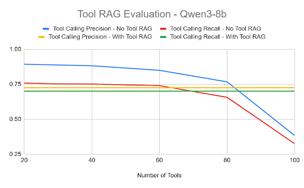
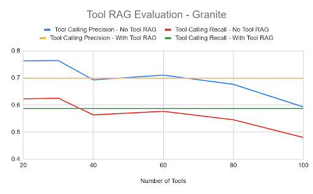

# Tool RAG Experiments  
*A modular evaluation framework and UI for exploring Tool RAG and related solutions.*

## Overview  
This repository contains a proof-of-concept implementation of **Tool RAG (Retrieval-Augmented Generation with tool-use)**, paired with a flexible evaluation framework and a lightweight Streamlit UI.

At its core, the project offers a fully operational Tool RAG algorithm (implemented in [`evaluator/algorithms/tool_rag_algorithm.py`](./evaluator/algorithms/tool_rag_algorithm.py)) which has been carefully tuned to maximise performance. The implementation is designed so that it can be easily adopted by any system or inference pipeline looking to incorporate tool-enabled retrieval-augmented generation.

Other features include:  
- An evaluation framework for configuring and running experiments (via `main.py`).  
- A simple interactive UI built with Streamlit to showcase how the Tool RAG algorithm performs in practice.  
- Modular architecture supporting easy extension (algorithms + metric collectors).  

---

## Getting Started

### Prerequisites  
- Python (as specified in `requirements.txt`)  
- A virtual environment is strongly recommended.  
- Familiarity with YAML configuration.

### Install & Setup  
```bash
git clone https://github.com/redhat-et/tool-rag-experiments.git
cd tool-rag-experiments
python -m venv .venv
source .venv/bin/activate
pip install -r requirements.txt
```

### Run an Evaluation

From the repository root directory:
```bash
python main.py --config evaluator/config/yaml/your_config.yaml
```

- `--config` specifies the YAML configuration file. See `evaluator/config/yaml/` for examples.

- If you want to override default settings (i.e., disable use of default algorithm or metric defaults), use:
```bash
python main.py --config evaluator/config/yaml/your_config.yaml --no-defaults
```

### Launch the Streamlit UI
```bash
streamlit run streamlit_app.py
```

This opens a local interactive web app allowing you to try the Tool RAG implementation in real time.

---

### Project Structure
Focusing on the evaluation framework part:

```graphql
evaluator/
├── algorithms/              # implementations of Tool RAG and other algorithms
│   └── tool_rag_algorithm.py  # core Tool RAG implementation
├── config/
│   └── yaml/                # YAML configuration files for experiments
├── data/                    # (optional) datasets used in evaluation
├── interfaces/
│   ├── algorithm.py         # base class for algorithm implementations
│   └── metric_collector.py  # base class for metric collector implementations
├── metric_collectors/       # metric collector implementations
├── utils/                   # utility modules
└── …
main.py                      # entry point for the evaluation framework
```

---

### Extending the Framework

#### Adding a New Algorithm
1. Create a subclass of the base class in `evaluator/interfaces/algorithm.py`.

2. Place your new implementation under `evaluator/algorithms/`.

3. Add an entry in your YAML configuration to reference your new algorithm class and any parameters.

4. Run the evaluation using main.py (with or without `--no-defaults` depending on whether you want to bypass built-in defaults).

#### Adding a New Metric Collector
1. Create a subclass of the base class in `evaluator/interfaces/metric_collector.py`.

2. Place it under `evaluator/metric_collectors/`.

3. Update your YAML configuration to include your new metric collector.

4. Run the evaluation through `main.py`, specifying your config file.

---

### Experimental Results

We evaluated the Tool RAG algorithm using the [StableToolBench dataset](https://github.com/THUNLP-MT/StableToolBench).
Here are our main findings:

- Our Tool RAG implementation achieved retrieval accuracy of 0.97 (97 % accuracy) under the best-performing configuration.

- The Tool RAG algorithm consistently outperforms baseline models as the number of tools grows - see attached graphs below.

- The most effective optimizations were:

  - Embedding by tool name + description alone.

  - Reranking of retrieved results.

  - Truncating long tool descriptions to 256 characters.

- Other well-known RAG techniques (such as hybrid search, post-retrieval filtering, query decomposition / rewriting, text normalisation) provided little to no improvement compared to the baseline.






---

### License
This project is licensed under the [Apache License 2.0](./LICENSE).
